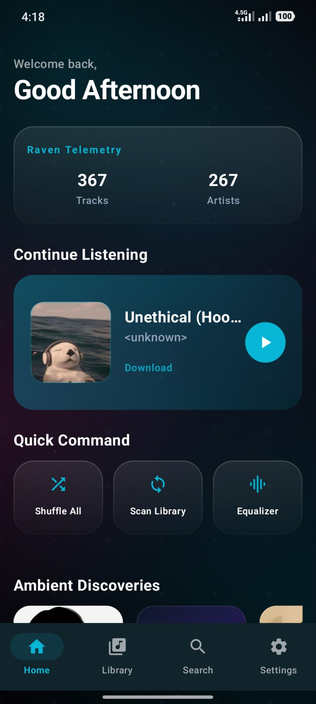
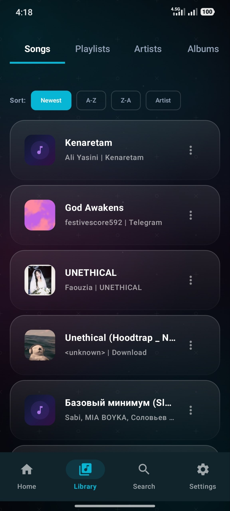
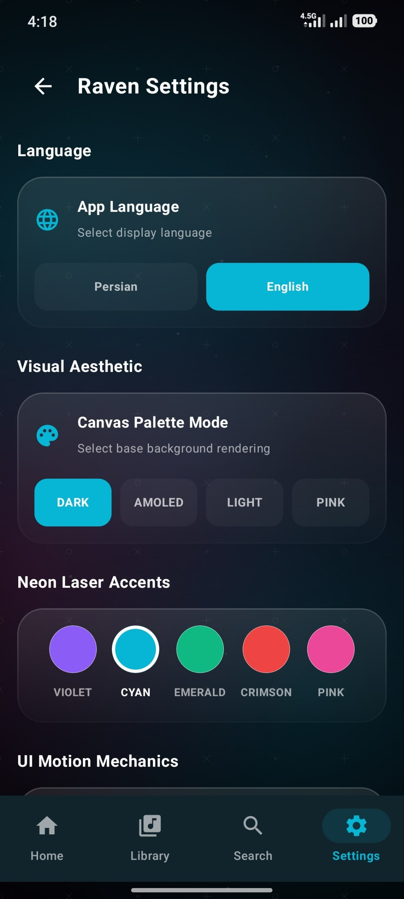
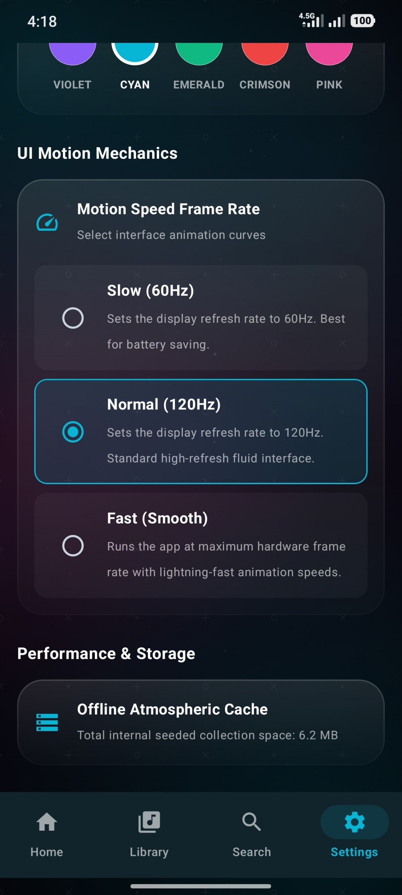
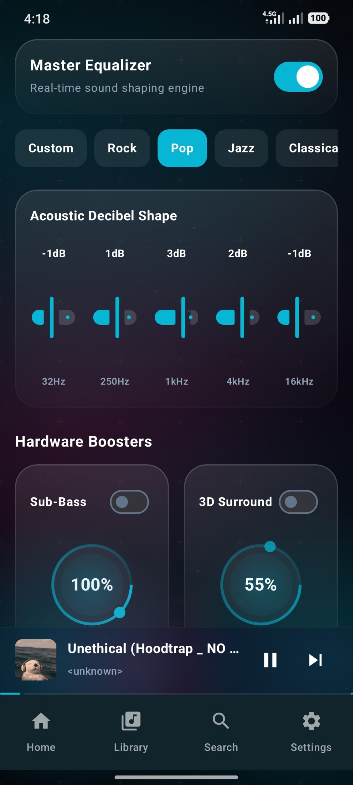
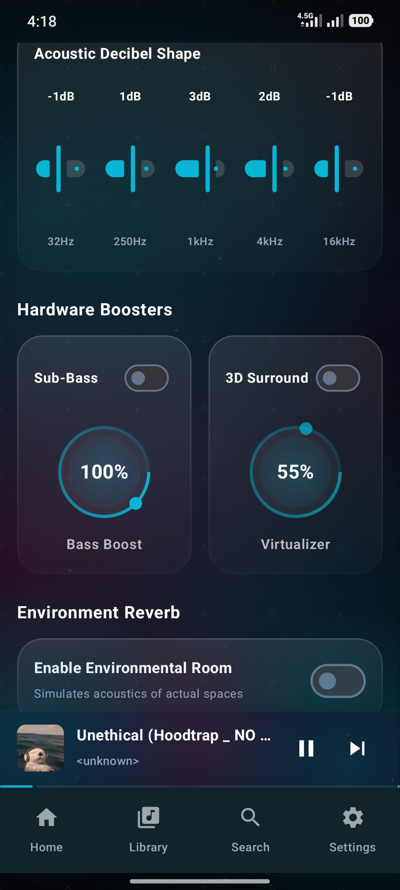

<h3 align="center">
🎵 A Modern Offline Music Experience
</h3>

A clean, fast and beautiful music player built for Android.

---

# 🎵 About RavenPlayer

RavenPlayer is a modern offline music player designed to provide a smooth and enjoyable listening experience.

Built with a focus on:

✨ Beautiful design  
⚡ Fast performance  
🎧 Simple music management  
📱 Smooth Android experience  

RavenPlayer brings your local music library into a clean and elegant interface.

---

# ✨ Features

🎵 **Offline Music Playback**  
Play your favorite songs without requiring an internet connection.

📂 **Local Music Library**  
Manage and enjoy music stored directly on your device.

🎨 **Modern User Interface**  
A clean and intuitive design focused on usability.

⚡ **Smooth Performance**  
Optimized for a fast and responsive experience.

🔊 **Immersive Listening Experience**  
Designed to make music playback enjoyable.

---

# 🛠️ Built With

---

# 📸 Screenshots

  

  

---

# 🚀 Release

RavenPlayer is currently completed and preparing for official release.

Future releases will be available through official platforms.

---

# 🐦‍⬛ About Raven Studio

RavenPlayer is developed by **Raven Studio**.

Creating digital products with focus on:

- Modern design
- Great user experience
- Smooth performance
- Creative solutions

---

# 📬 Contact

📧 ravenstudio.app@gmail.com

 

🐦‍⬛ Raven Studio

---

⭐ Thanks for checking out RavenPlayer.

**Listen. Enjoy. Experience.**

